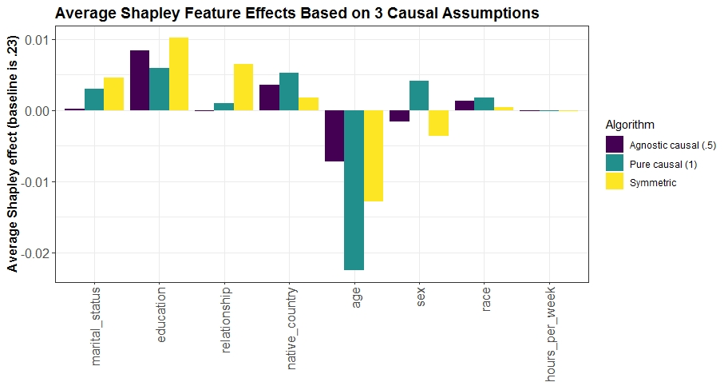
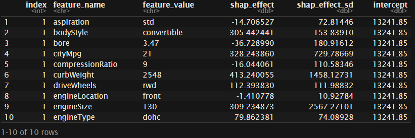
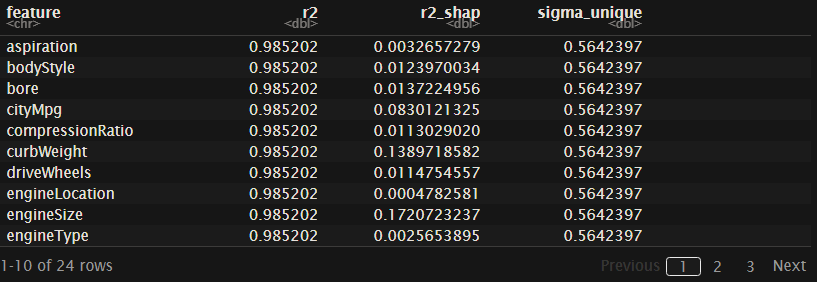

[](https://www.tidyverse.org/lifecycle/#experimental)
[](https://travis-ci.org/nredell/shapFlex)
[](https://codecov.io/github/nredell/shapFlex)

                                                                               
# package::shapFlex 

The purpose of `shapFlex`, short for Shapley flexibility, is to compute stochastic feature-level Shapley values which 
can be used to (a) interpret and/or (b) assess the fairness of any machine learning model while 
**incorporating causal constraints into the model's feature space**. **[Shapley values](https://christophm.github.io/interpretable-ml-book/shapley.html)** 
are an intuitive and theoretically sound model-agnostic diagnostic tool to understand both **global feature importance** across all instances in a data set 
and instance/row-level **local feature importance** in black-box machine learning models.


* **Any ML model** + **Causal hypotheses among features** + **Shapley algorithm** = **Causal ML model interpretability**

This package implements the algorithm described in 
[Štrumbelj and Kononenko's (2014) sampling-based Shapley approximation algorithm](https://link.springer.com/article/10.1007%2Fs10115-013-0679-x) 
to compute the stochastic Shapley values for a given model feature and the algorithm described in 
[Frye, Feige, & Rowat's (2019) Asymmetric Shapley values: incorporating causal knowledge into model-agnostic explainability](https://arxiv.org/pdf/1910.06358.pdf) 
to incorporate prior knowledge into the Shapley value calculation. Asymmetric Shapley values can be tuned by the researcher to avoid splitting 
the Shapley feature effects uniformly across related/correlated features--as is done in the symmetric case--and focus on the unique effect of a target 
feature after having conditioned on other pre-specified "causal" feature effects.

* **Flexibility**: 
    + Shapley values can be estimated for <u>any machine learning model</u> using a simple user-defined 
    `predict()` wrapper function.
    + Shapley values can be estimated by incorporating prior knowledge about causaility in the feature space; this is especially 
    useful for interpreting time series models with a temporal dependence.

* **Speed**:
    + The code itself hasn't necessarily been optimized for speed. The speed advantage of `shapFlex` comes in the form of giving the user the ability 
 to <u>select 1 or more target features of interest</u> and avoid having to compute Shapley values for all model features. This is especially 
 useful in high-dimensional models as the computation of a Shapley value is exponential in the number of features.


## README Contents

* **[Install](#install)**
* **[Vignettes](#vignettes)**
* **Examples**
    + **[Symmetric Shapley values](#symmetric-shapley-values)**
    + **[Asymmetric causal Shapley values (EXPERIMENTAL)](#asymmetric-causal-shapley-values)**
    + **[R2 decomposition](#r2-decomposition)**
* **[Cite](#cite)**
* **[References](#references)**
* **[Roadmap](#roadmap)**


## Install

* Development

``` r
devtools::install_github("nredell/shapFlex")
library(shapFlex)
```

## Vignettes

**[Consistency between stochastic and tree-based Shapley values.](https://nredell.github.io/shapFlex/doc/consistency.html)** 

## Examples

### Symmetric Shapley values

* TBD

### Asymmetric causal Shapley values

**EXPERIMENTAL**

Below is an example of how `shapFlex` can be used to compute Shapley values for a subset of model 
features from a Random Forest model based on 3 sets of assumptions about causality amongst the model features:

**1. Symmetric:** Default. No causal knowledge is incorporated into the Shapley calculations.

**2. Asymmetric with weights = .5:** Agnostic causality. Similar to the symmetric algorithm. The difference is 
that, in the asymmetric algorithm, the entire set of causal effects is conditioned on as a group; the 
symmetric algorithm would condition on random subsets of the causal features.

**3. Asymmetric with weights = 1:** Pure causality. The Shapley estimates for the causal targets are 
based on the actual/true/known feature values of the causal effects. Put another way, the estimates for 
the causal targets have been conditioned on the causal effects which decreases their magnitude. 
The Shapley estimates for the causal effects will then increase correspondingly to satisfy the Shapley property 
that the sum of the feature-level effects equals the model prediction.

``` r
library(shapFlex)
library(dplyr)
library(ggplot2)
library(randomForest)

# Input data: Adult aka Census Income dataset.
data("data_adult", package = "shapFlex")
data <- data_adult
#------------------------------------------------------------------------------
# Train a machine learning model; currently limited to single outcome regression and binary classification.
outcome_name <- "income"
outcome_col <- which(names(data) == outcome_name)

model_formula <- formula(paste0(outcome_name,  "~ ."))

set.seed(1)
model <- randomForest::randomForest(model_formula, data = data, ntree = 300)
#------------------------------------------------------------------------------
# A user-defined prediction function that takes 2 positional arguments and returns
# a 1-column data.frame of predictions for each instance to be explained: (1) A trained
# ML model object and (2) a data.frame of model features; transformations of the input
# data such as converting the data.frame to a matrix should occur within this wrapper.
predict_function <- function(model, data) {
  
  # We'll predict the probability of the outcome being >50k.
  data_pred <- data.frame("y_pred" = predict(model, data, type = "prob")[, 2])
  return(data_pred)
}
#------------------------------------------------------------------------------
# shapFlex setup.
explain <- data[1:300, -outcome_col]  # Compute Shapley feature-level predictions for 300 instaces.

reference <- data[, -outcome_col]  # An optional reference population to compute the baseline prediction.

sample_size <- 60  # Number of Monte Carlo samples.

target_features <- c("marital_status", "education", "relationship",  "native_country",
                     "age", "sex", "race", "hours_per_week")  # Optional: A subset of features.

causal <- data.frame(
  "cause" = c("age", "sex", "race", "native_country",
              "age", "sex", "race", "native_country", "age",
              "sex", "race", "native_country"),
  "effect" = c(rep("marital_status", 4), rep("education", 4), rep("relationship", 4))
                     )
```

* Plot the causal setup.

``` r
set.seed(1)
p <- ggraph(causal, layout = "kk")
p <- p + geom_edge_link(aes(start_cap = label_rect(node1.name),
                            end_cap = label_rect(node2.name)),
                        arrow = arrow(length = unit(5, 'mm'), type = "closed"),
                        color = "grey25")
p <- p + geom_node_label(aes(label = name), fontface = "bold")
p <- p + scale_x_continuous(expand = expand_scale(0.2))
p <- p + theme_graph(foreground = 'white', fg_text_colour = 'white')
p
```


* Calculate the Shapley values from our model under various degrees of belief in the causal structure.

``` r
# 1: Non-causal symmetric Shapley values: ~10 seconds to run.
set.seed(1)
explained_non_causal <- shapFlex::shapFlex(explain = explain,
                                           reference = reference,
                                           model = model,
                                           predict_function = predict_function,
                                           target_features = target_features,
                                           sample_size = sample_size)
#------------------------------------------------------------------------------
# 2: Causal asymmetric Shapley values with full causal weights of 1: ~30 seconds to run.
set.seed(1)
explained_full <- shapFlex::shapFlex(explain = explain,
                                     reference = reference,
                                     model = model,
                                     predict_function = predict_function,
                                     target_features = target_features,
                                     causal = causal,
                                     causal_weights = rep(1, nrow(causal)),  # Pure causal weights
                                     sample_size = sample_size)
#------------------------------------------------------------------------------
# 3: Causal asymmetric Shapley values with agnostic causal weights of .5: ~30 seconds to run.
set.seed(1)
explained_half <- shapFlex::shapFlex(explain = explain,
                                     reference = reference,
                                     model = model,
                                     predict_function = predict_function,
                                     target_features = target_features,
                                     causal = causal,
                                     causal_weights = rep(.5, nrow(causal)),  # Approximates symmetric calc.
                                     sample_size = sample_size)
```

* Reshape the data for plotting.

``` r
explained_non_causal_sum <- explained_non_causal %>%
  dplyr::group_by(feature_name) %>%
  dplyr::summarize("shap_effect" = mean(shap_effect, na.rm = TRUE))
explained_non_causal_sum$type <- "Symmetric"

explained_full_sum <- explained_full %>%
  dplyr::group_by(feature_name) %>%
  dplyr::summarize("shap_effect" = mean(shap_effect, na.rm = TRUE))
explained_full_sum$type <- "Pure causal (1)"

explained_half_sum <- explained_half %>%
  dplyr::group_by(feature_name) %>%
  dplyr::summarize("shap_effect" = mean(shap_effect, na.rm = TRUE))
explained_half_sum$type <- "Agnostic causal (.5)"
#------------------------------------------------------------------------------
# Plot the Shapley feature effects for the target features.

data_plot <- dplyr::bind_rows(explained_non_causal_sum, explained_full_sum, explained_half_sum)

# Re-order the target features so the causal outcomes are first.
data_plot$feature_name <- factor(data_plot$feature_name, levels = target_features, ordered = TRUE)

p <- ggplot(data_plot, aes(feature_name, shap_effect, fill = ordered(type)))
p <- p + geom_col(position = position_dodge())
p <- p + theme_bw() + theme(
  plot.title = element_text(size = 14, face = "bold"),
  axis.title = element_text(size = 12, face = "bold"),
  axis.text.x = element_text(angle = 90, hjust = 1, vjust = .5, size = 12),
  axis.text.y = element_text(size = 12)
)
p <- p + xlab(NULL) + ylab("Average Shapley effect (baseline is .23)") + labs(fill = "Algorithm") +
  ggtitle("Average Shapley Feature Effects Based on 3 Causal Assumptions")
p
```


***

### R2 decomposition

The code below illustrates how to decompose a regression model's R^2 to get global measures 
of feature importance for any black box model. The `shapFlex::r2()` will also work with Shapley 
values computed from other packages.

``` r
library(shapFlex)
library(dplyr)
library(tidyr)
library(ggplot2)
library(randomForest)

data("imports85", package = "randomForest")
data <- imports85

data <- data[, -2]  # This column has excessive missing data.
data <- data[complete.cases(data), ]
#------------------------------------------------------------------------------
# Train a machine learning model; currently limited to single outcome regression and binary classification.

outcome_col <- which(names(data) == "price")
outcome_name <- names(data)[outcome_col]

model_formula <- formula(paste0(outcome_name,  "~ ."))

model <- randomForest::randomForest(model_formula, data = data, ntree = 300)
#------------------------------------------------------------------------------
# A user-defined prediction function that takes 2 positional arguments and returns
# a 1-column data.frame of predictions for each instance to be explained: (1) A trained
# ML model object and (2) a data.frame of model features; transformations of the input
# data such as converting the data.frame to a matrix should occur within this wrapper.
predict_function <- function(model, data) {

  data_pred <- data.frame("y_pred" = predict(model, data))
  return(data_pred)
}
#------------------------------------------------------------------------------
# shapFlex setup.

# Compute Shapley feature-level predictions for all 193 instaces in the dataset.
explain <- data[, -outcome_col]

reference <- NULL  # The optional reference group is not needed because we're using the population.

sample_size <- 60  # Number of Monte Carlo samples.

target_features <- NULL  # Default; compute Shapley values for all features.
#------------------------------------------------------------------------------
# Symmetric Shapley values with no causal specifications; ~10 seconds to run.
set.seed(224)
data_shap <- shapFlex::shapFlex(explain = explain,
                                reference = reference,
                                model = model,
                                predict_function = predict_function,
                                target_features = target_features,
                                sample_size = sample_size)

head(data_shap, 10)
```


* Reshape the data for `r2()`.

``` r
data_shap_wide <- tidyr::pivot_wider(data_shap, id_cols = "index",
                                     names_from = "feature_name", values_from = "shap_effect")

data_shap_wide$index <- NULL

head(data_shap_wide)
```


``` r
y <- data[, outcome_name]
intercept <- unique(data_shap$intercept)

shapFlex::r2(data_shap_wide, y, intercept)
```



***

## Cite

At the moment, the best citation for this package is related to the `shapFlex::r2()` function.

Redell, N. (2019). [Shapley decomposition of R^2 in machine learning models](https://arxiv.org/abs/1908.09718). arXiv preprint arXiv:1908.09718.


## References

Štrumbelj, E. & Kononenko, I. (2014) Explaining prediction models and individual predictions with feature contributions. Knowl Inf Syst (2014) 41: 647. https://doi.org/10.1007/s10115-013-0679-x


## Roadmap

* Thorough unit testing with many different causal setups and simulated, ground truth data.

* Vignettes detailing how the algorithms work--in pictures.

* Think about how `lavaan` and `piecewiseSEM` models might be incorporated.
