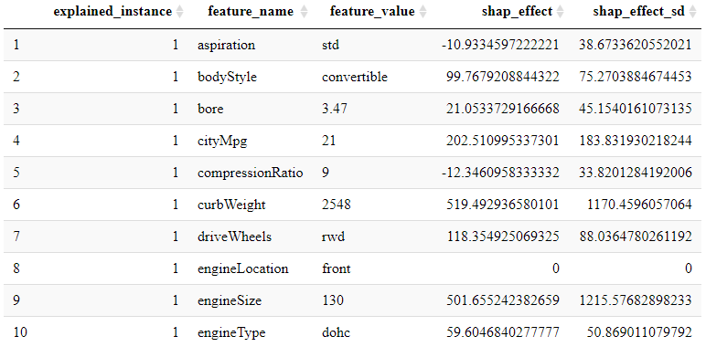

[](https://www.tidyverse.org/lifecycle/#experimental)

# package::shapFlex 

The purpose of `shapFlex`, short for Shapley flexibility, is to compute stochastic feature-level Shapley values 
for machine learning ensemble models using potentially different, high-dimensional input datasets. **[Shapley values](https://christophm.github.io/interpretable-ml-book/shapley.html)** are a great model-independent way to understand both **global feature importance** (when plotted like a [partial dependence plot](https://projecteuclid.org/download/pdf_1/euclid.aos/1013203451)) and instance/row-level **local feature importance** in black-box machine learning models. The main function in this package is `shapFlex::shapFlex()`.

* **package::shapFlex Flexibility**: 
    + Shapley values can be estimated for ensembles of <u>many machine learning models</u> using a simple user-defined predict() wrapper function.
    + Shapley values can be estimated for a given feature if it appears in <u>multiple datasets</u> in a more elaborate ensemble model.

* **package::shapFlex Speed**:
    + The code itself hasn't necessarily been optimized for speed. The speed advantage of `shapFlex` comes in the form of giving the user the ability 
    to <u>select 1 or more target features of interest</u> and avoid having to compute Shapley values for all model features. This is especially 
    useful in high-dimensional models as the computation of a Shapley value is exponential in the number of features.

***

## Install

``` r
devtools::install_github("nredell/shapFlex")
library(shapFlex)
```

## Getting Started

Detailed **[shapFlex overview vignette](https://nredell.github.io/data_science_blog/shapFlex/)**.

Detailed **[shapFlex runtime/speed vignette](https://nredell.github.io/data_science_blog/shapFlex/speed/)**.

## Example

* Below is an example of how `shapFlex` can be used to compute Shapley values for measuring the effect of 
~20 model features used in an ensemble of 2 machine learning models on the price of cars in the `imports85` 
dataset from the `randomForest` package.

``` r
# Load packages and data.
library(dplyr)
library(shapFlex)
library(glmnet)
library(randomForest)

data("imports85", package = "randomForest")
data <- imports85

data <- data[, -2]  # this column has excessive missing data.
data <- data[complete.cases(data), ]
row.names(data) <- 1:nrow(data)  # re-index for simplicity.
#------------------------------------------------------------------------------
# Train machine learning models.

outcome_col <- which(names(data) == "price")
outcome_name <- names(data)[outcome_col]

model_formula <- formula(paste0(outcome_name,  "~ ."))

set.seed(224)
model_lasso <- glmnet::cv.glmnet(x = model.matrix(model_formula, data), 
                                 y = as.matrix(data[, outcome_col, drop = FALSE], ncol = 1))

set.seed(224)
model_rf <- randomForest::randomForest(formula = model_formula, data = data, ntree = 200)
#------------------------------------------------------------------------------
# A user-defined prediction function that takes 2 positional arguments and returns 
# a 1-column data.frame (see the package overview vignette for more info).

predict_ensemble <- function(models, data, ...) {
  
  y_pred_lasso <- data.frame(predict(models[[1]], model.matrix(~ ., data)))  # LASSO
  y_pred_rf <- data.frame(predict(models[[2]], data))  # Random Forest
  
  data_pred <- dplyr::bind_cols(y_pred_lasso, y_pred_rf)
  
  data_pred <- data.frame("y_pred" = rowMeans(data_pred, na.rm = TRUE))
  
  return(data_pred)
}
#------------------------------------------------------------------------------
# Setting key shapFlex::shapFlex() parameters.

# A list of data.frame(s) of model features suitable for the user-defined predict function(s).
data_list <- list(data[, -(outcome_col), drop = FALSE])
# Dataset row numbers or indicies.
explain_instances <- 1:30
# Are the instances to explain row numbers/indices or row names ('row_name') in the input data?
explain_instance_id <- "row_index"
# A list of of model objects. Nested lists of length(data_list) are needed if length(data_list) > 1.
model_list <- list(model_lasso, model_rf)
# A list of length 1 vectors with length(prediction_functions) == length(data_list).
predict_functions <- list("predict_ensemble")
# The number of randomly selected dataset rows used to calculate the feature-level Shapley values.
sample_size <- 60
# Number of cores to use in parallel::mclapply(); limited to 1 on Windows OS.
n_cores <- if (Sys.info()["sysname"] == "Windows") {1} else {parallel::detectCores() - 1}
#------------------------------------------------------------------------------
# Explaining 1 instance at a time-of 30 total-with shapFlex::shapFlex(). This example, explaining with 
# all model features, may take a minute or two to run.

explained_instances <- vector("list", length(explain_instances))

set.seed(224)
for (i in seq_along(explain_instances)) {
  
  explained_instances[[i]] <- shapFlex::shapFlex(data = data_list, 
                                                 explain_instance = explain_instances[i],  # loop
                                                 explain_instance_id = explain_instance_id,
                                                 models = model_list, 
                                                 predict_functions = predict_functions, 
                                                 sample_size = sample_size, 
                                                 n_cores = n_cores)
}
#------------------------------------------------------------------------------
# Return the list of instance-level results as a data.frame.

data_shap <- dplyr::bind_rows(explained_instances)

DT::datatable(data_shap)
```


